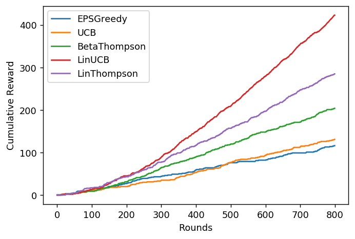
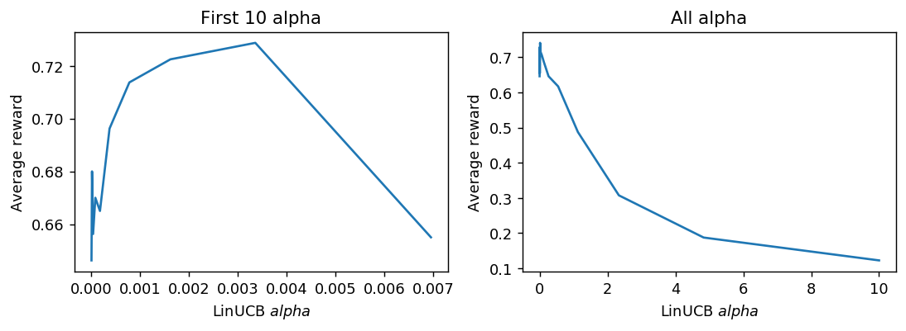
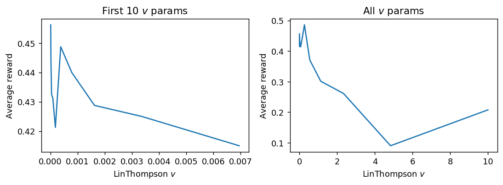
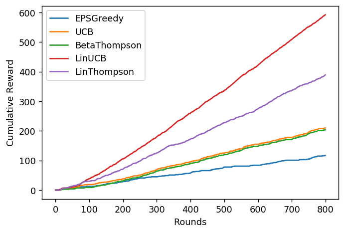

# Multi-armed bandits Implementation & Evaluation

This project implements famous MAB algorithms and evaulates them on the basis of their performance.

### Offline evaluation for algorithms without parameter tuning

```python
....
# Run offline evaluation for algorithms
# EpsilonGreedy
mab = EpsGreedy(10, params['eps_greedy'])
results_EpsGreedy = offlineEvaluate(mab, arms, rewards, contexts, T)
# UCB
mab = UCB(10, params['ucb'])
results_UCB = offlineEvaluate(mab, arms, rewards, contexts, T)
# BetaThompson
mab = BetaThompson(10, params['beta_thompson'][0], params['beta_thompson'][1])
results_BetaThompson = offlineEvaluate(mab, arms, rewards, contexts, T)
# LinUCB
mab = LinUCB(10, 10, params['lin_ucb'])
results_LinUCB = offlineEvaluate(mab, arms, rewards, contexts, T)
# LinThompson
mab = LinThompson(10, 10, params['lin_thompson'])
results_LinThompson = offlineEvaluate(mab, arms, rewards, contexts, T)
....
```




### GridSearch for LinUCB

```python
# generate 20 numbers for alpha between 10^-5 to 10^1
alphas = np.logspace(-5,1,20)

# set grid parameters with alphas
grid_parameters = {'narms': 10, 'ndims': 10, 'param_range': alphas,'rounds': 800}

# create gridsearch object with strategy and scoring function
grid_linucb = GridSearchMAB(mab=LinUCB, param_grid=grid_parameters, scoring=offlineEvaluate, strategy='naive',verbose=1)

# run gridsearch on provided data
grid_linucb.fit(arms,rewards,contexts)
```



### GridSearch for LinThompson

```python
# generate 20 numbers for alpha between 10^-5 to 10^1
vparams = np.logspace(-5,1,20)

# set grid parameters with alphas
grid_parameters = {'narms': 10, 'ndims': 10, 'param_range': vparams,'rounds': 800}

# create gridsearch object with strategy and scoring function
grid_linthompson = GridSearchMAB(mab=LinThompson, param_grid=grid_parameters, scoring=offlineEvaluate, strategy='naive',verbose=1)

# run gridsearch on provided data
grid_linthompson.fit(arms,rewards,contexts)
```



### Offline evaluation for algorithms with parameter tuning

```python
evaluation(T=800,params={'eps_greedy':grid_epsgreedy.best_param_, 'ucb':grid_ucb.best_param_, 'beta_thompson':[1.0,1.0], 'lin_ucb':grid_linucb.best_param_, 'lin_thompson':grid_linthompson.best_param_})
```


